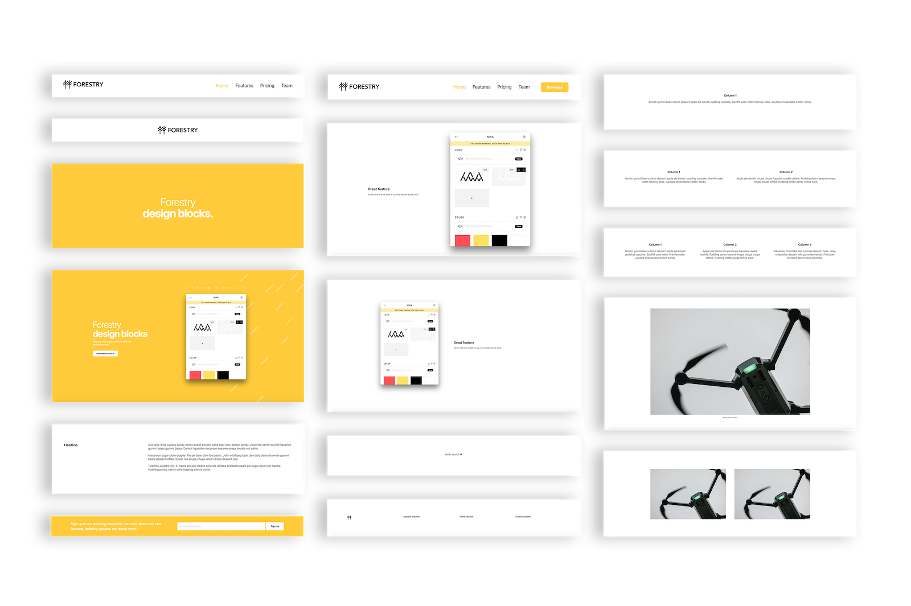

# uBuild Jekyll Theme

[View the announcement post on Forestry.io](https://forestry.io/blog/ubuild-a-new-theme-for-static-sites-using-blocks/#/)

`ubuild-jekyll` is a Jekyll theme designed to work with [Forestry](https://forestry.io/)'s [Blocks](https://forestry.io/blog/blocks-give-your-editors-the-power-to-build-pages/) feature.  This theme provides a set of page-level components and a pre-configured Forestry Blocks UI that will empower content editors to construct their own webpages.

## Quick Start

*This option is available for Github and Gitlab users only. If you use Bitbucket please use the Alternative Setup*

## Alternative Setup

1. Fork this repo
2. [Sign up for a free Forestry account](https://app.forestry.io/signup)
3. [Import your repo](https://forestry.io/docs/quickstart/setup-site/#import-site-from-repo) as a new Jekyll project

To use the page builder, select the **Page Builder** template when creating a new page.

